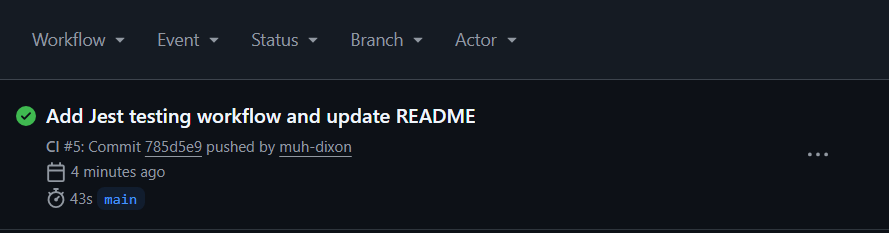

# CareerTrack

[](https://github.com/muh-dixon/job-app-tracker/actions/workflows/ci.yml)

A full-stack job application tracking platform built with Next.js, TypeScript,
Supabase, PostgreSQL, and GitHub Actions.

CareerTrack helps job seekers manage applications, interviews, notes, job links,
and hiring progress while demonstrating authenticated CRUD workflows, protected
API routes, user-scoped data access, automated testing, CI validation, and
production deployment.

**Live Demo:** https://job-app-tracker-aar6em2ac-shabils-projects-6e585193.vercel.app/?auth=login  
**Repository:** https://github.com/muh-dixon/job-app-tracker

## Project Overview

I built CareerTrack to solve a problem I experienced during my own job search:
keeping application details, statuses, interview progress, notes, and job links
organized across multiple platforms.

The project became a practical way to deepen my understanding of full-stack
architecture, authentication, authorization, database security, testing, and
deployment.

## Screenshots

### Login


### Dashboard Empty State


### Dashboard With Application


### Demo


### Validation Results



- [Lighthouse report for the signed-in experience](public/demo/lighthouse-careertrack-v3.pdf)
- [Lighthouse report for the log-in dashboard](public/demo/lighthouse-careertrack-v3-auth.pdf)

## Features

- Supabase email/password authentication
- Protected dashboard experience for signed-in users
- Create, read, update, and delete job applications
- Track company, role, location, salary, job link, status, and notes
- Search applications by company or role
- Filter applications by application status
- Dashboard progress metrics for total applications, applied roles, interviews, and offers
- Real-time frontend state updates after create, update, and delete actions
- Responsive layout for desktop and mobile screens
- Protected API routes with authenticated user checks

## Tech Stack

- **Framework:** Next.js App Router
- **Frontend:** React, TypeScript
- **Styling:** Tailwind CSS
- **Backend:** Next.js Route Handlers
- **Auth & Database:** Supabase Auth, Supabase PostgreSQL
- **Testing:** Jest, React Testing Library
- **Deployment:** Vercel
- **CI/CD:** GitHub Actions

## Engineering Workflow

This project was developed with a focus on practical full-stack fundamentals:

- Built authenticated frontend flows using Supabase sessions
- Scoped application data to the authenticated user
- Used API routes for server-side CRUD operations
- Validated form and application status data before database updates
- Improved accessibility with semantic HTML, labels, ARIA attributes, and landmarks
- Used Lighthouse reports to identify and fix Core Web Vitals issues
- Added frontend integration-style tests with mocked Supabase auth and mocked API calls
- Tested both signed-out auth screens and authenticated dashboard states
- Added coverage for application creation, bearer-token API requests, and API error handling
- Added CI validation for dependency installation, linting, tests, and production builds through GitHub Actions

## Lighthouse Optimization

Lighthouse audits were used to improve frontend quality and verify performance changes across both authenticated and signed-out states.

Final Lighthouse scores:

| Category | Score |
| --- | ---: |
| Performance | 98 |
| Accessibility | 100 |
| Best Practices | 100 |
| SEO | 100 |

Optimization work included:

- Added semantic landmarks, including a proper `<main>` landmark
- Improved form accessibility with explicit labels and ARIA attributes
- Reduced Cumulative Layout Shift from `0.476` to `0`
- Stabilized the auth-loading and signed-out login rendering flow
- Removed the separate spinner-only auth loading layout in favor of a stable login card shell
- Reserved consistent layout space for loading and dynamic UI states
- Preserved the dashboard visual design while improving frontend stability

## Development & Delivery Pipeline

The repository includes a GitHub Actions workflow that runs on pushes to `main` and on pull requests.

CI validates:

- Dependency installation with `npm ci`
- ESLint checks with `npm run lint`
- Frontend test coverage with `npm test`
- Production build verification with `npm run build`

Workflow file:

```text
.github/workflows/ci.yml
```

The CI workflow helps catch linting, test, and build issues before changes are merged or deployed.

## Testing

CareerTrack-v1 uses Jest and React Testing Library for beginner-friendly frontend tests focused on user-visible behavior and key authenticated dashboard flows.

Testing setup includes:

- Jest configured with `next/jest`
- React Testing Library for rendering components and querying accessible UI
- `@testing-library/user-event` for realistic typing and click interactions
- `@testing-library/jest-dom` for readable DOM assertions
- A mocked Supabase auth client so tests do not depend on real auth sessions
- Mocked `fetch` calls so dashboard tests do not make real API or network requests
- Authenticated and unauthenticated rendering paths
- Error-state coverage for failed dashboard application loading
- Bearer-token assertions for authenticated API requests

### Current Test Coverage

The current frontend test suite includes 6 passing tests:

1. Login page render test
2. Email and password input interaction test
3. Login submit behavior test with Supabase `signInWithPassword`
4. Authenticated dashboard render test with mocked application data
5. New application creation test that asserts the expected `POST /api/applications` request and payload
6. API error handling test for a failed initial `GET /api/applications` request

These tests are intentionally focused and integration-style at the page level. They verify important user flows without claiming exhaustive application or backend coverage.

### Future Testing Improvements

- Split dashboard tests into a dedicated suite as coverage grows
- Add smaller component-level tests for reusable dashboard UI pieces
- Add additional API route integration tests for update, delete, filtering, and authorization edge cases

## Installation

Clone the repository:

```bash
git clone https://github.com/muh-dixon/job-app-tracker.git
cd job-app-tracker
```

Install dependencies:

```bash
npm install
```

## Environment Variables

Create a `.env.local` file in the project root:

```env
NEXT_PUBLIC_SUPABASE_URL=your_supabase_project_url
NEXT_PUBLIC_SUPABASE_PUBLISHABLE_KEY=your_supabase_publishable_key
SUPABASE_SERVICE_ROLE_KEY=your_supabase_service_role_key
```

Variable notes:

- `NEXT_PUBLIC_SUPABASE_URL` points the app to the Supabase project.
- `NEXT_PUBLIC_SUPABASE_PUBLISHABLE_KEY` is used by the browser client for Supabase Auth.
- `SUPABASE_SERVICE_ROLE_KEY` is used only on the server for protected database operations.
- Do not commit `.env.local` or service role secrets.

## Running Locally

Start the development server:

```bash
npm run dev
```

Open the app:

```text
http://localhost:3000
```

Run lint:

```bash
npm run lint
```

Run tests:

```bash
npm test
```

Create a production build:

```bash
npm run build
```

## Deployment

CareerTrack-v1 is deployed on Vercel. The production deployment uses the same Next.js build process validated by the GitHub Actions workflow.

For deployment, configure the required Supabase environment variables in the Vercel project settings:

```text
NEXT_PUBLIC_SUPABASE_URL
NEXT_PUBLIC_SUPABASE_PUBLISHABLE_KEY
SUPABASE_SERVICE_ROLE_KEY
```

## Security Considerations

CareerTrack includes several security-focused design decisions:

- User authentication through Supabase Auth
- Application data scoped to the authenticated user
- Row Level Security policies for database access
- Protected API routes with authenticated user validation
- Service-role credentials restricted to server-side use
- Environment variables excluded from version control
- Input validation before database updates
- Bearer-token handling for authenticated API requests

Future security improvements include dependency scanning, automated vulnerability
checks, stronger API authorization testing, and security-focused CI validation.

## Author

Built by [muh-dixon](https://github.com/muh-dixon) as a full-stack portfolio project focused on authentication, CRUD workflows, responsive UI, accessibility, and production validation.
