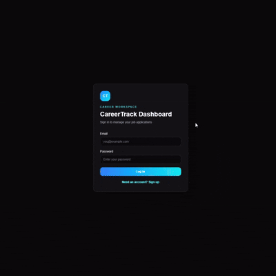
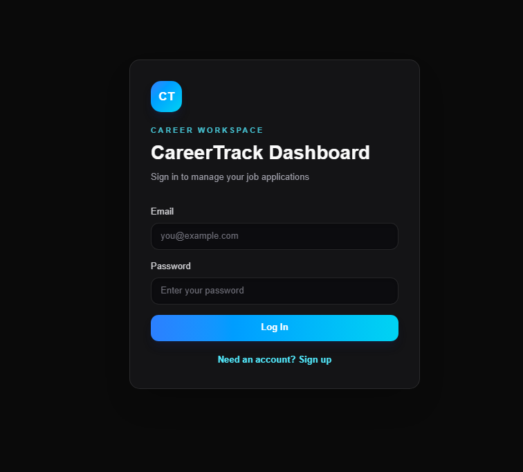
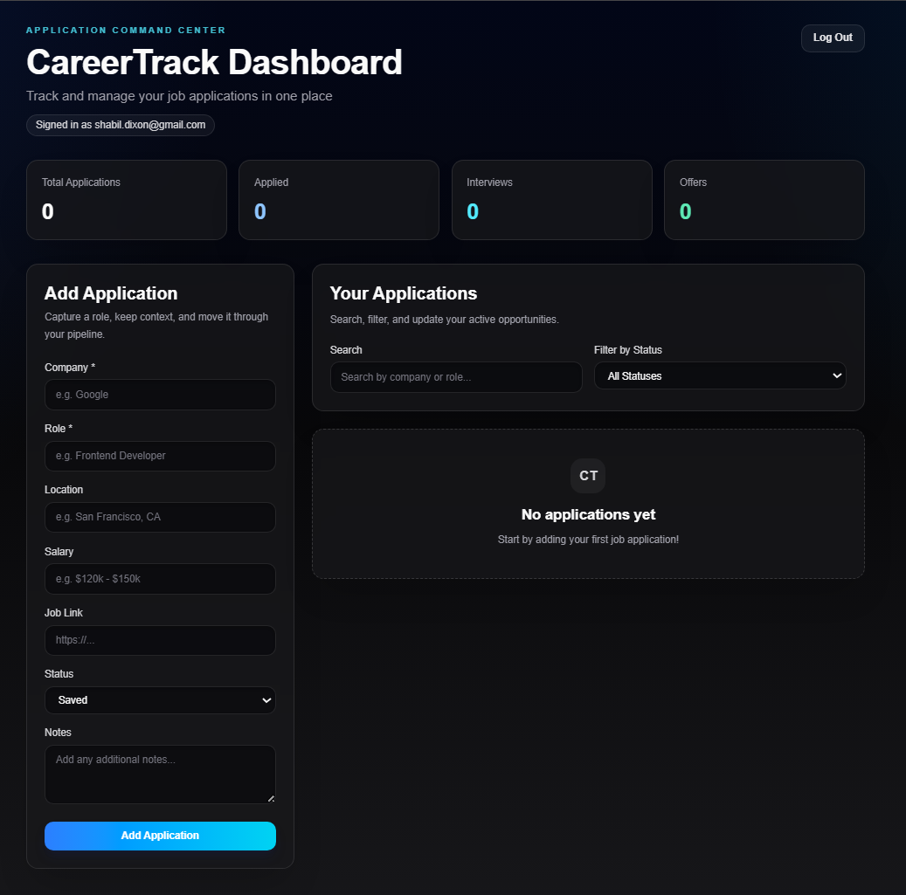
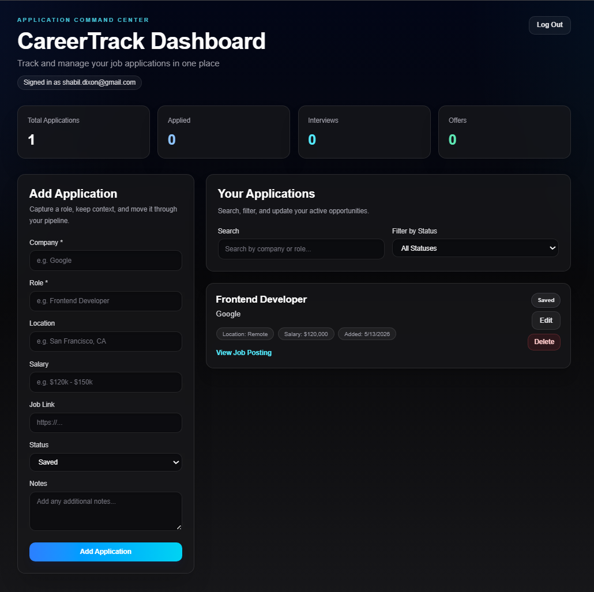

# CareerTrack Dashboard

CareerTrack Dashboard is an authenticated full-stack job application tracker for job seekers who want a simple way to manage roles, statuses, notes, and job links during a search. It solves the problem of scattered job search tracking by combining a protected Next.js dashboard with Supabase Auth, PostgreSQL persistence, protected API routes, Tailwind CSS, and Row Level Security.

Live Demo: https://job-app-tracker-aar6em2ac-shabils-projects-6e585193.vercel.app/?auth=login

GitHub: https://github.com/muh-dixon/job-app-tracker

## Demo



## Short Description

CareerTrack lets authenticated users create, update, delete, search, and filter job applications from a single dashboard. Each user's application data is scoped to their Supabase account and protected through API authentication checks and database-level RLS policies.

## Screenshots

### Login



### Empty Dashboard



### Dashboard With Application



## Features

- Email/password authentication with Supabase Auth
- Persistent authenticated sessions
- Protected dashboard access
- Create, read, update, and delete job applications
- Track company, role, location, salary, job link, status, and notes
- Search applications by company or role
- Filter applications by status
- Dashboard stats for total applications, applied roles, interviews, and offers
- Duplicate application checks scoped to the authenticated user
- Protected Next.js API routes
- PostgreSQL persistence through Supabase
- Row Level Security for user-owned application rows

## Tech Stack

- Next.js App Router
- React
- TypeScript
- Tailwind CSS
- Supabase Auth
- Supabase PostgreSQL
- Next.js API Routes
- Vercel

## Architecture / How It Works

The app uses Supabase Auth for user sessions and Next.js API routes for server-side CRUD operations. The browser retrieves the active Supabase access token and sends it with each application request. API routes verify the token, identify the authenticated user, and scope database queries by `user_id`.

```text
User signs in
-> Supabase Auth creates a session
-> Dashboard requests application data
-> API route validates the access token
-> Supabase/PostgreSQL queries are scoped by user_id
-> RLS policies enforce row ownership
-> React state updates the dashboard
```

Main API routes:

- `GET /api/applications` returns applications owned by the authenticated user.
- `POST /api/applications` creates a new application for the authenticated user.
- `PUT /api/applications/:id` updates an application only when it belongs to the authenticated user.
- `DELETE /api/applications/:id` deletes an application only when both `id` and `user_id` match.

Security layers:

- Supabase Auth manages signup, login, logout, and sessions.
- Next.js route protection redirects unauthenticated users away from the dashboard.
- API routes validate bearer tokens before database operations.
- Row Level Security protects application rows at the database level.
- The Supabase service role key is used only on the server.

## Environment Variables

Create a `.env.local` file for local development:

```env
NEXT_PUBLIC_SUPABASE_URL=your_supabase_project_url
NEXT_PUBLIC_SUPABASE_PUBLISHABLE_KEY=your_supabase_publishable_key
SUPABASE_SERVICE_ROLE_KEY=your_supabase_service_role_key
```

Notes:

- `NEXT_PUBLIC_SUPABASE_URL` points the app to the Supabase project.
- `NEXT_PUBLIC_SUPABASE_PUBLISHABLE_KEY` is used by browser code for Supabase Auth.
- `SUPABASE_SERVICE_ROLE_KEY` must stay server-side and should never be exposed in client code.
- `.env.local` should not be committed.

## Getting Started

Install dependencies:

```bash
npm install
```

Run the development server:

```bash
npm run dev
```

Open the local app:

```text
http://localhost:3000
```

Build for production:

```bash
npm run build
```

## What I Learned

- Building authenticated full-stack features with Next.js and Supabase
- Protecting API routes with bearer token validation
- Modeling user-owned data with PostgreSQL and `user_id`
- Applying Row Level Security as a database-level safety layer
- Managing client-side auth state and server-side data access together
- Deploying a full-stack Next.js application with environment variables on Vercel

## Future Improvements

- Add screenshot assets to the README
- Add application sorting by date, company, and status
- Add reminders or follow-up dates
- Add CSV export for saved applications
- Add richer analytics for pipeline progress
- Add automated tests for API route behavior
